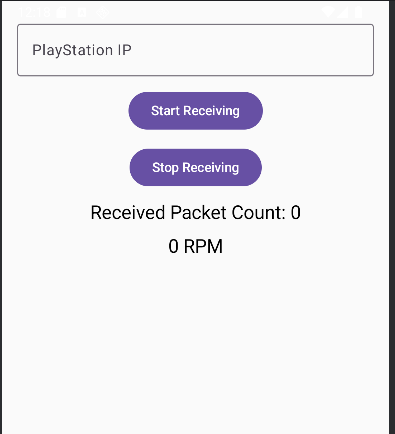
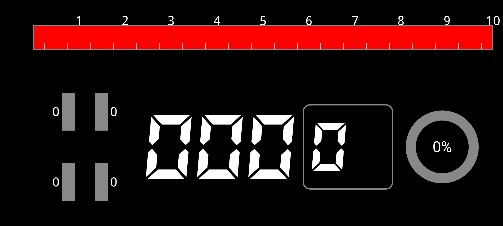
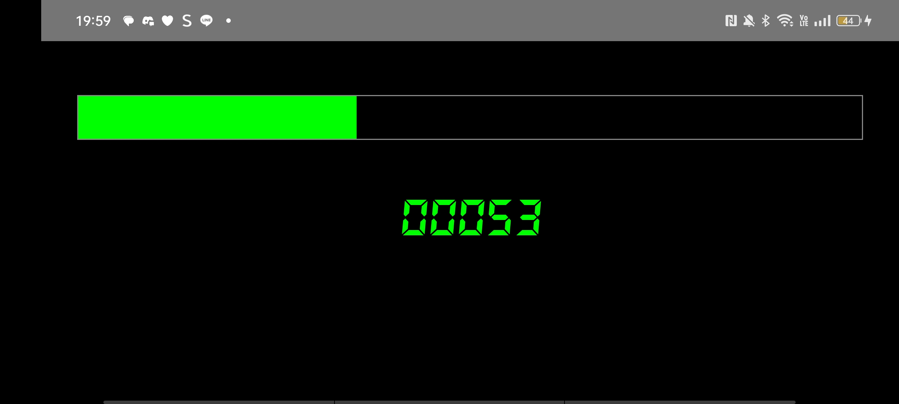

# GT7 Dashboard (Kotlin/Android)

A customizable dashboard application built using Kotlin and native Android features. It receives telemetry data transmitted via UDP communication from the racing game Gran Turismo 7 (GT7) and visualizes it in real-time.
---

## Project Status
The current project has established the core communication infrastructure necessary to receive data from GT7.

### Current Features

- **IP Address Input**: Allows setting the PlayStation console's IP address.
- **UDP Receive Control**: Buttons to start and stop data reception.
- **Packet Counter**: Displays the number of packets received, confirming successful communication.
- **RPM (Engine Revolutions)**:  Extracts and displays the RPM value from the incoming telemetry data.

---

## Extension Examples & Possibilities

The established foundation (UDP reception, RPM extraction, Kotlin/Compose UI) allows for easy construction and extension into a full-featured, customizable dashboard UI.

### Extended Dashboard Example

These examples illustrate the potential for visualizing RPM data and customizing the UI.

---

## Leveraging Kotlin/Android Native Strengths

The project is written in Kotlin, allowing developers to maximize the use of Android's native capabilities for high performance and rich features.

| Extension Feature | Implementation Detail | Relevant Technology Stack |
|---------|---------|----------------|
| **Rich UI Drawing** | Build complex UIs like RPM bars, gear indicators, speedometers, and custom digital displays, similar to the preview images. | Jetpack Compose or Custom View |
| **Data Analysis & Logging** | Parse incoming UDP data and record it to a database (e.g., Room) or files for later post-race analysis. | Kotlin Coroutines, Room DB |
| **Fuel/Lap Count Display** | Display current fuel level and the number of laps completed during the race. | UDP Data Parsing |
| **ペPedal Input Visualization** | Visualize throttle and brake input values in real-time to analyze driving precision. | UDP Data Parsing |

This project benefits from Kotlin's fast data processing capabilities and the seamless integration of Android's native functionalities.

---

## Technical Stack

- **Language**: Kotlin
- **UI**: Jetpack Compose
- **Communication**: UDP Socket
- **Platform**: Android

---

## Future Direction

We aim to leverage GT7's telemetry data to provide a realistic dashboard experience for racing simulators. By using an Android device as a second screen, this project offers a more immersive gaming experience.
